## Исследование тестовой базы данных "Tesla"

### Анализ данных

> Задание 1. Какая модель Tesla самая продающаяся? Впишите количество проданных машин в поле ответа

Ответ: Tesla Model 3. Количество: 6 штук

Для определения количества проданных автомобилей достаточно сгруппировать данные из таблицы продаж `order_items` по идентификаторам товара. Для получения же конкретного наименования необходдимо присоединить к `order_items` таблицу `items`

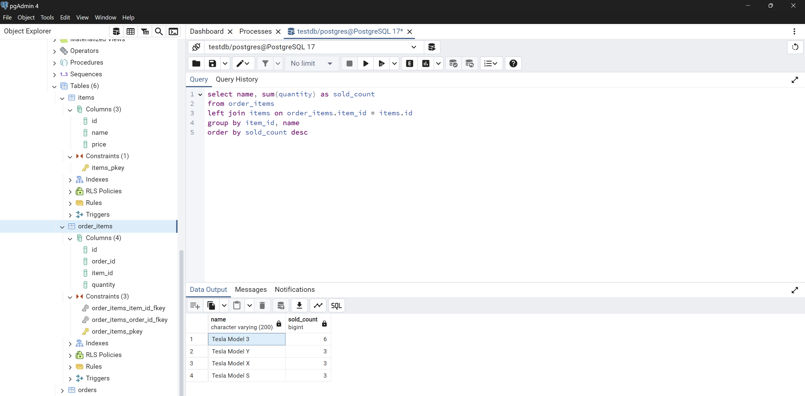

> Задание 2. В каком месяце было сделано больше всего продаж? Впишите в поле ответа месяц в том же формате.

Ответ: больше всего продаж было в марте 2020 года. Объем продаж: 6 единиц

Для начала необходимо определиться с необходимыми данными для выполнения поставленной задачи - дата продажи и количество проданного товара. В качестве даты продажи подойдет дата оформления заказа. Следовательно, необходимо объединить таблицы, в которых эти данные есть.

Затем данные группируются по дате, преобразованной к формату `YYYY-MM-01`, что позволяет выполнить группировку с учетом года и месяца совершения продажи, но без учета конкретного дня (хоть для имеющихся данных учитывать год и не обязательно)

Затем выполняется подсчет количества проданных единиц товара различных наименований в рамках конкретного месяца года

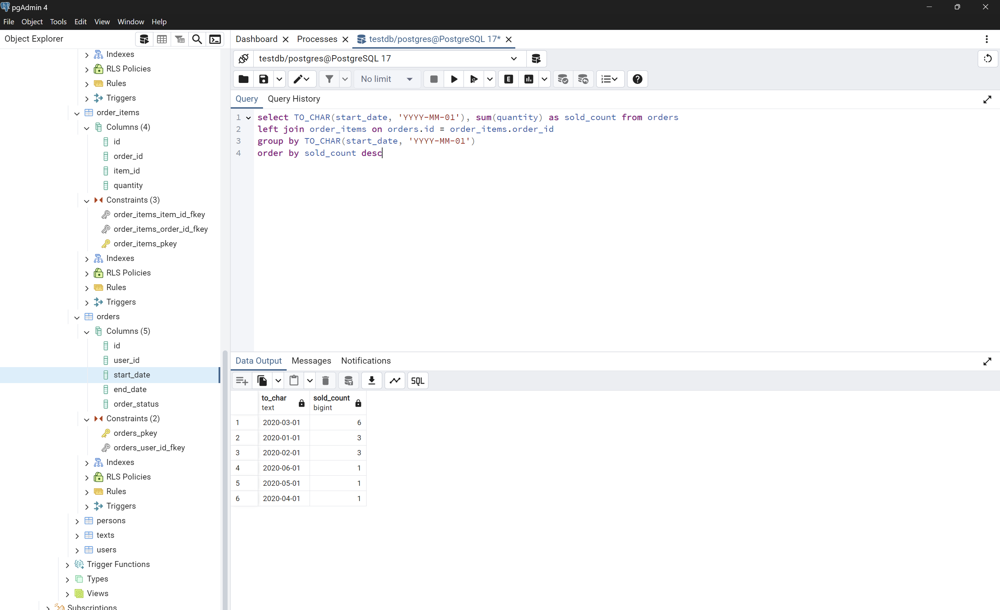

> Задание 3. Как зовут пользователя, у которого больше всего машин?

Ответ: John

Для начала объединяю таблицы, содержащие необходимые данные для подсчета количества приобретенных авто и определения имени их владельцев. В качестве "моста" между пользователями и списком продаж выступает таблица `orders`.

Для определения - какой пользователь, сколько автомобилей приобрел, группирую данные по идентификаторам пользователей и суммирую количество приобретенных авто, после чего упорядочиваю записи по количеству (по убыванию).

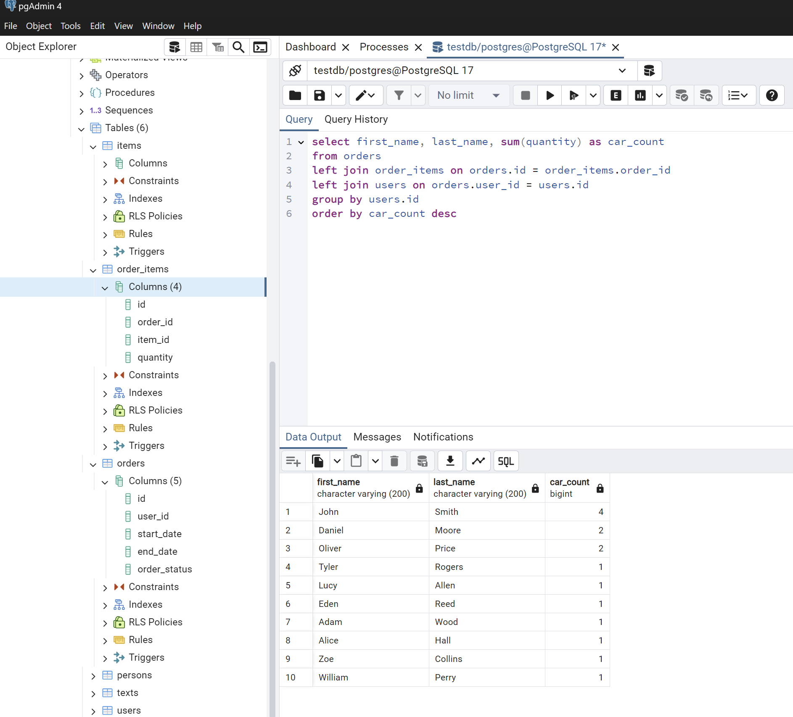

> Задание 4. В каком городе было продано больше всего машин?

Ответ: Los Angeles

Аналогично предыдущему заданию, только группировка после получения объединенной таблицы производится по полю `city`.

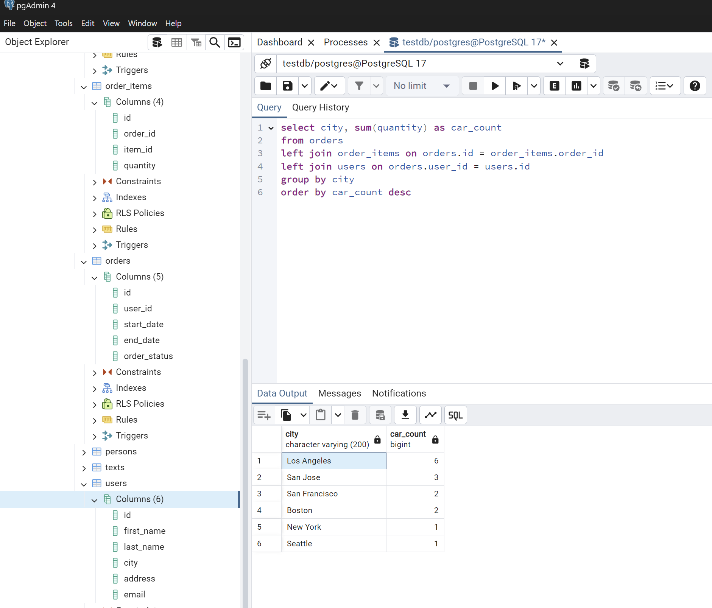

> Задание 5. В каких городах покупают самые дорогие модели? В поле ответа введите среднюю цену для данных городов.

Ответ: New York, Boston. Средняя цена покупаемого автомобиля: 74990

Дополнительно присоединил таблицу, содержащую цены купленных авто. Группировка по городу с вычислением средней цены авто по городу

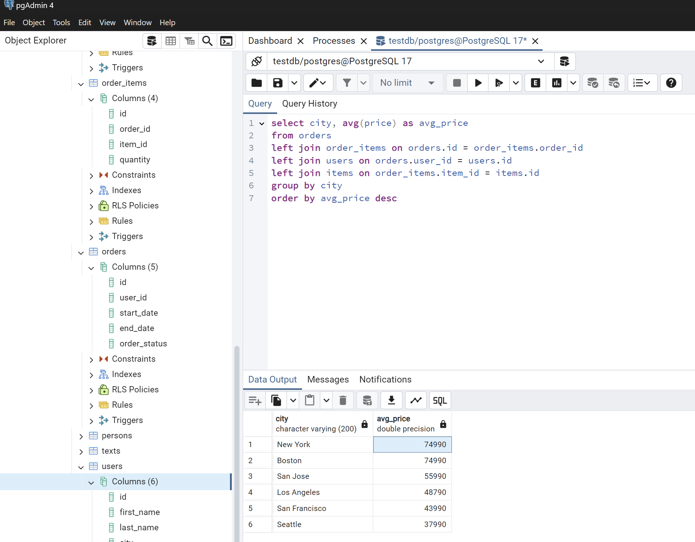


### Операции с текстом

> Задание 6. Объедините имя владельца машины и его город в строку, созданную по следующему шаблону: "ИМЯ_ВЛАДЕЛЬЦА from НАЗВАНИЕ_ГОРОДА", пример требуемой строки - "Anna from Moscow". Из всех записей выбрать ту, которая соответствует владельцу, у которого больше всего машин

Ответ: "John from Los Angeles"

Алгоритм аналогичен заданию 3 и дополнен выражением конкатенации после оператора `SELECT`

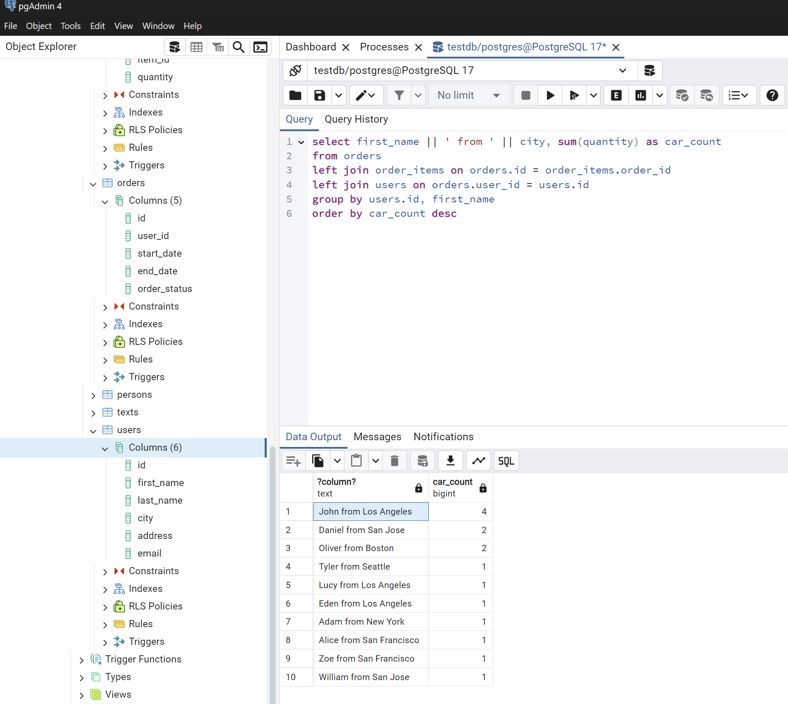

> Задание 7. Посчитайте количество символов в email пользователя с id = 9.

Ответ: 19

Простая выборка с фильтром по идентификатору пользователя. Для подсчета количества символов в строке используется функция `LENGTH`

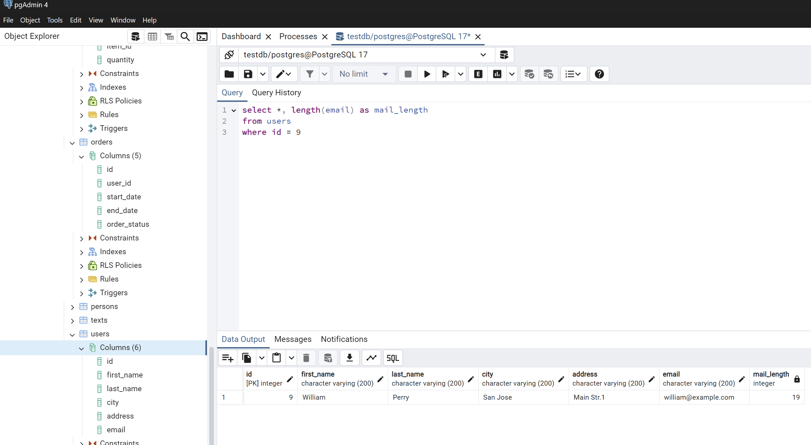

> Задание 8. Замените example в эмэйлах пользователей на tesla.

Задание подразумевает работу с `SELECT` (т.е. без изменения данных в самой БД)

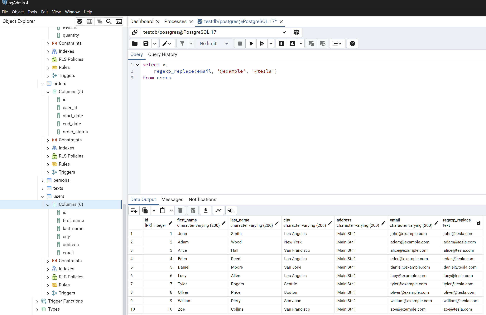

### Представления и табличные выражения

> Задание 9. Создайте представление с пользователями из Лос Анжелеса и обратитесь к нему при помощи запроса.

Для создания представления используется оператор `CREATE VIEW`

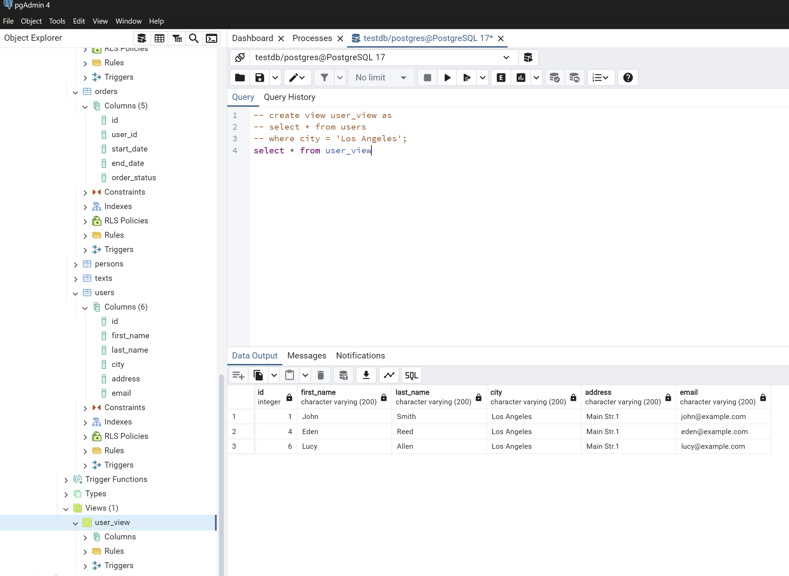

> Задание 10. Создайте табличное выражение с теми же условиями и обратитесь к нему при помощи запроса.

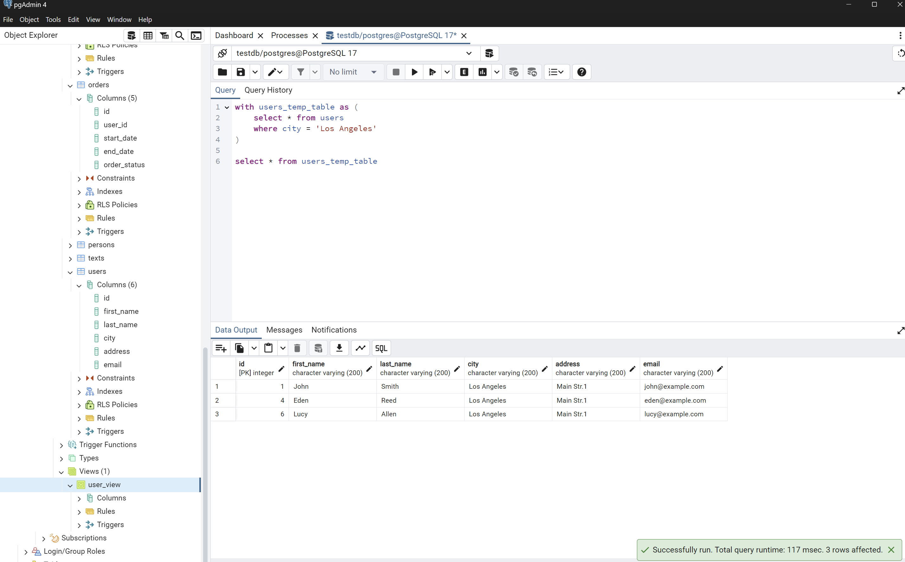

> Задание 11. Создайте два индекса для полей order_id и item_id таблицы order_items.

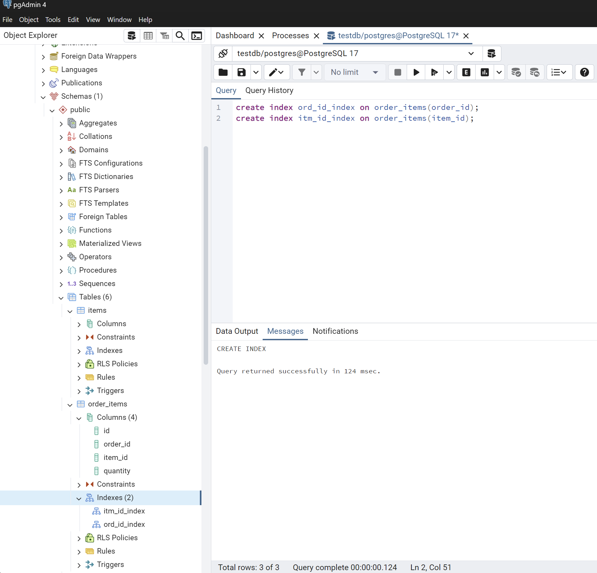

> Задание 12. Выполните запрос и изучите что написано в плане запроса.

Запрос: 

```
explain
select * from users left join orders on orders.user_id = users.id where orders.start_date != '2020-01-01'
```

План выполнения SQL-запроса в PostgreSQL описывает шаги, которые выполняются для получения результата. В PostgreSQL операции выполняются в соответствии с планом выполнения, начиная с самых нижних узлов (сначала читает таблицы, затем производит соединение). Данная схема обеспечивает логическое выполнение запросов, где данные из одной таблицы обрабатываются до того, как они используются в других операциях.

**Порядок выполнения** шагов в приведенном плане:

1. **Seq Scan on users (cost=0.00..10.30 rows=30 width=2094)**
   - Это самый нижний шаг. PostgreSQL выполняет **последовательное сканирование** таблицы `users`, чтобы получить все строки (около 30 строк). Так как это последовательное сканирование, PostgreSQL проходит через все строки таблицы и извлекает данные. На данном этапе не применяется никаких фильтров или условий.
   - Каждая строка таблицы `users` занимает около 2094 байт.

2. **Hash (cost=10.30..10.30 rows=30 width=2094)**
   - После сканирования таблицы `users`, PostgreSQL создает **хеш-таблицу** на основе данных, полученных на предыдущем шаге. Эта хеш-таблица будет использоваться для быстрого поиска совпадающих строк из таблицы `orders` при соединении.
   - Хеш-таблица строится на основе ключа соединения: `users.id`.

3. **Seq Scan on orders (cost=0.00..22.38 rows=985 width=54)**
   - Теперь PostgreSQL выполняет **последовательное сканирование** таблицы `orders`. Здесь строки фильтруются по условию: `start_date <> '2020-01-01'`. Ожидается, что после применения фильтра будет отобрано около 985 строк.
   - Каждая строка таблицы `orders` занимает 54 байта.

4. **Hash Join (cost=10.68..35.69 rows=985 width=2148)**
   - Этот шаг объединяет строки из таблиц `orders` и `users` с помощью **хеш-джоина**. PostgreSQL использует хеш-таблицу, созданную на шаге 2, чтобы найти строки из таблицы `orders`, у которых поле `user_id` совпадает с полем `id` в таблице `users`.
   - Ожидается, что в результате соединения будет получено около 985 строк.

### Визуализированный порядок выполнения:

1. **Последовательное сканирование таблицы `users`** → 2. **Создание хеш-таблицы на основе данных из `users`** → 3. **Последовательное сканирование таблицы `orders` с фильтром** → 4. **Соединение с помощью Hash Join**.

### Причина этого порядка:

- PostgreSQL сначала собирает данные из таблицы `users` и строит хеш-таблицу, чтобы можно было эффективно соединять строки с таблицей `orders`.
- После этого выполняется последовательное сканирование таблицы `orders`, и при нахождении строки с нужным значением поля `user_id`, оно проверяется на соответствие значениям, которые уже находятся в хеш-таблице.
  
Этот порядок выполнения соответствует стандартной схеме для **хеш-джоина**, где одна таблица сканируется и ее данные хешируются, а затем другая таблица сканируется с проверкой на соответствие хеш-значениям.

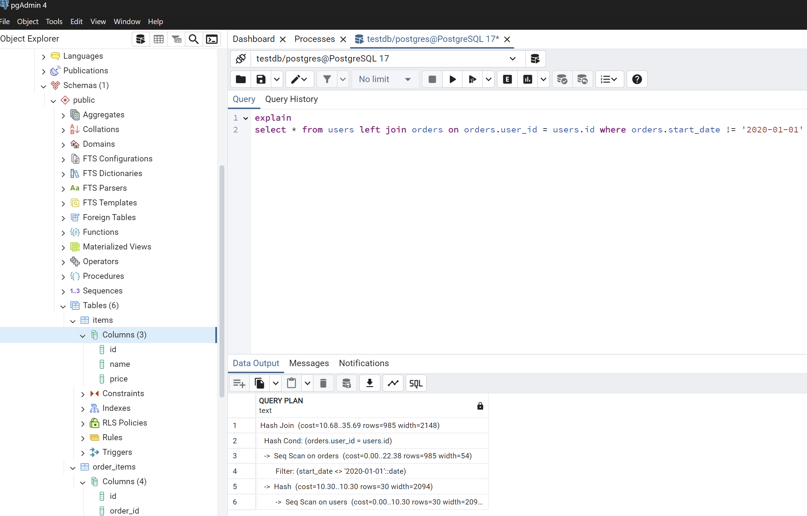

> Задание 13. Отсортируйте автомобили по цене при помощи функции rank()

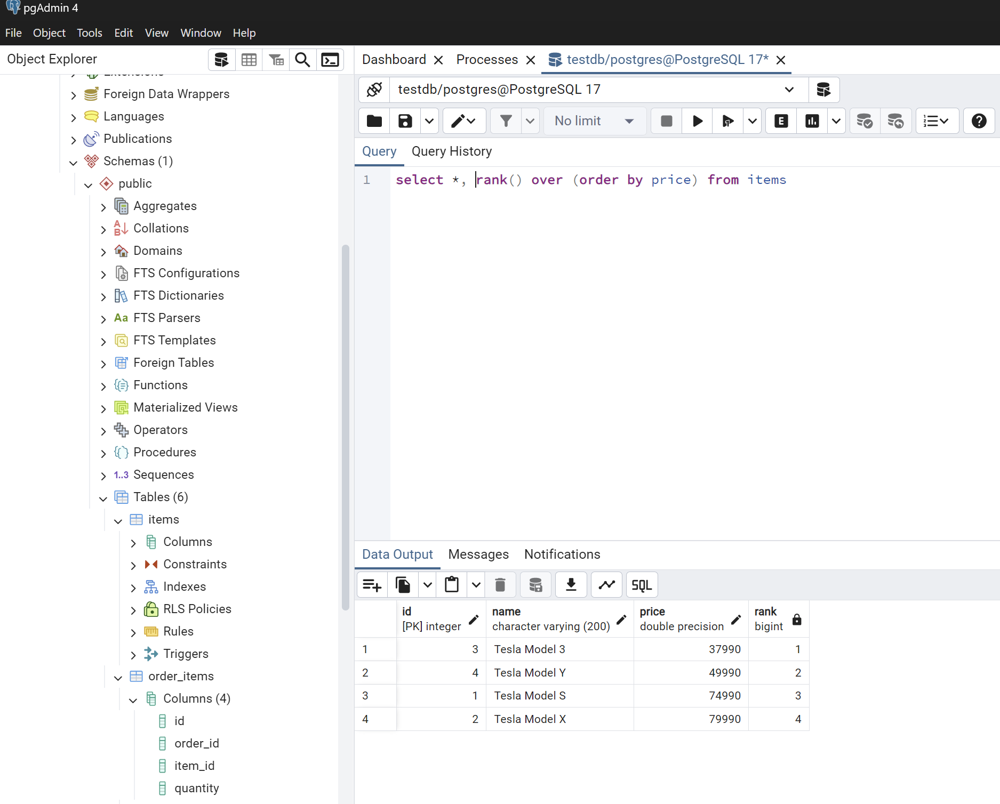

> Задание 14. Посчитайте количество проданных машин накопленным итогом по дням (по возрастанию). Сколько машин было продано в марте?

Ответ: в марте было продано 6 авто

Для начала объединяю таблицы, в которых есть данные, необходимые для вычислений (дата продажи и количество проданных авто). Затем данные группируются по дате продажи.
Вбирается количество проданных авто в конкретную дату и сумма накопленным итогом - количество проданных авто за текущий и предыдущие периоды.
Для того, чтобы вычислить сумму накопленным итогои, используется оконная функция sum и сортировка по дате (по возрастанию)
В качестве аргумента функции `sum` указывается sum(quantity) - количество проданных авто в конкретную дату 

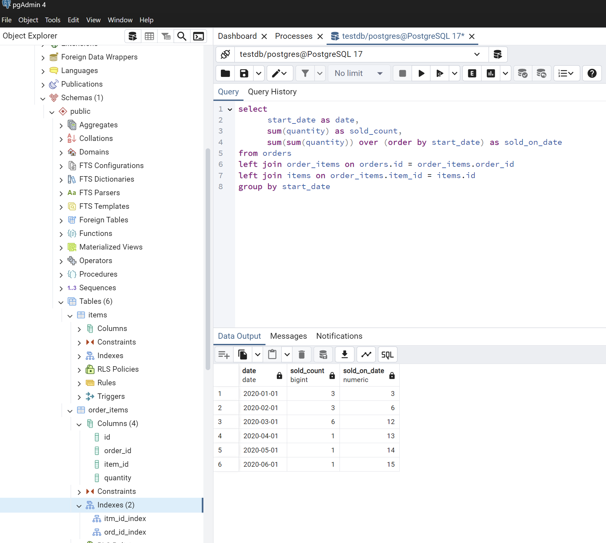