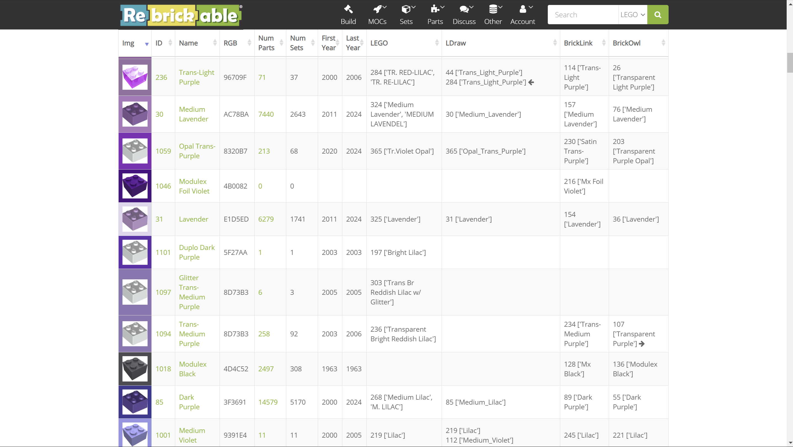
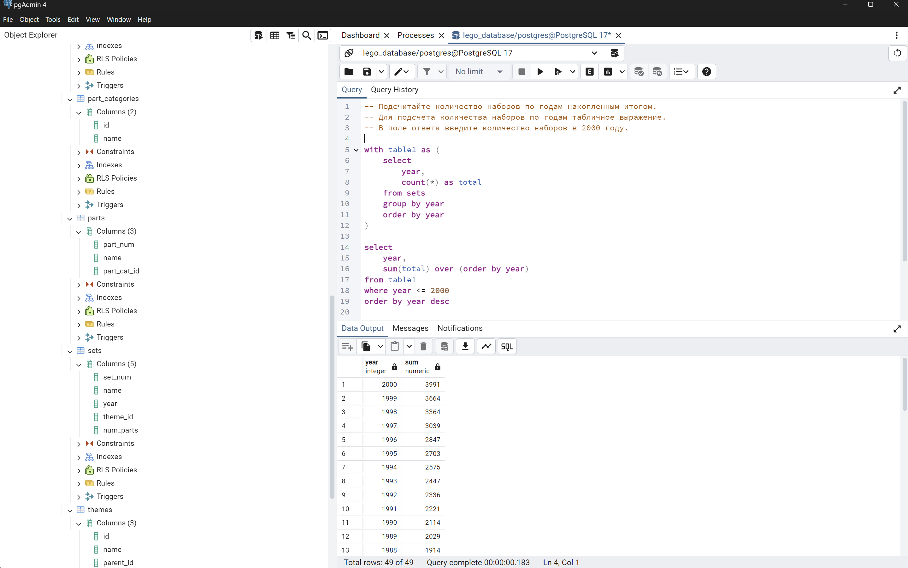

### Схема исследуемой базы данных LEGO

Датасет взят с [сайта Rebrickable](https://rebrickable.com/downloads/) 


#### Таблицы
+ colors –информация о доступных цветах,

+ sets – информация о наборах,

+ themes – информация о темах (например, Creator),

+ parts – информация об элементах наборов,

+ part_categories – информация о категориях элементов,

+ inventories – информация о товарах,
+ inventory_sets – информация о доступных наборах
+ inventory_parts – информация о доступных частях

Создал таблицы в соответствии со схемой данных. Выполнил импорт данных из соответствующих файлов `csv`, каталога `for_import`.

### Задания

> Задание 1. Сколько цветов есть в базе?

Ответ: 135

Пояснение: -


> Задание 2. С какого года по какой у нас есть информация о наборах? Ответ запишите в формате: год/год

Ответ: 1950/2017

Пояснение: -


> Задание 3. О каком количестве наборов у нас есть информация?

Ответ: 11673

Пояснение: -


> Задание 4. О каком количестве элементов у нас есть информация?

Ответ: 25993

Пояснение: -


> Задание 5. В каком году было выпущено больше всего наборов?

Ответ: 2014

Пояснение:
Группирую наборы по году выпуска, подсчитываю количество в каждой группе. Выполняю сортировку по убыванию и для оптимизации запроса ограничиваю выборку первой записью с наибольшим числом выпущенных наборов


> Задание 6. В каком году в среднем в наборах было больше всего частей?

Ответ: 2017

Пояснение: Образ действий аналогичен заданию 5. Для вычисления среднего значения используется функция `avg`. Дополнительно используется функция `round` для округления результата


> Задание 7. В каком году было использовано больше всего уникальных тем в наборах?

Ответ: 2015

Пояснение: Аналогично предыдущим заданиям. Для подсчета уникальных значений к полю `theme_id` применяю оператор `distinct`


> Задание 8. В какой категории больше всего элементов (частей)?

Ответ: Minifigs

Пояснение:
К таблице `parts` добавил данные из таблицы `part_categories`, чтобы дополнить результат наименованием категории. Сгруппировал данные по категории элемента + его наименованию (наименование на итоговом результате не скажется и необходимо в условии группировки только для возможности вывода в итоговой выборке). Выполняю подсчет количества элементов в каждой группе и сортирую результат по убыванию (из интереса не стал ограничивать выборку)


> Задание 9. Сколько наборов есть в запасе у магазина?

Ответ: 3916

Пояснение: Для подсчета количества наборов в наличии у магазина подсчитал сумму значений в поле `quantity` таблицы `inventory_sets`


> Задание 10. Сколько частей есть в запасе у магазина?

Ответ: 1929178

Пояснение: -


> Задание 11. Какой цвет самый популярный среди имеющихся элементов?

Ответ: Black

Пояснение: Для получения наименований цветов дополняю таблицы `inventory_parts` данными таблицы `colors`. Группирую данные по наименованию цвета и подсчитываю количество деталей в каждой группе (с учетом того, что элементов каждого наименования может быть несколько - `quantity`). Затем сортирую результат по убыванию количества элементов


> Задание 12. Сколько наборов есть в самой популярной теме?

Ответ: 496

Пояснение: Данные о наборах дополняю данными о темах. Группирую данные по теме и подсчитываю количество наборов в каждой теме (группе). Сортирую результат по убыванию количества наборов


> Задание 13. В какой теме больше всего элементов? В поле ответа впишите количество элементов.

Ответ: 100399

Пояснение: Аналогично предыдущему заданию. Подсчитываю сумму элементов в теме при помощи `sum`. Сортирую данные в порядке убывания количества деталей


> Задание 14. К какой группе тем относится набор, в котором больше всего элементов?

Ответ: Sculptures

Пояснение:
Набор LEGO может состоять из одного или нескольких комплектов (например, для "Basic Building Set": "010-3", "011-1", "022-1", "033-2" и т.д.). Этот момент обусловлен тем, что детали в наборе менялись в процессе производства или, возможно, для того, чтобы удовлетворить потребности разных географических регионов. Это стоит учитывать при определении набора с максимальным количеством деталей в рамках темы

Для начала дополнил данные наборов данными тем. Сгруппировал данные по наименованию набора (может быть несколько комплектов в рамках одного набора). При группировке дополнительно указал наименование темы (на результате не скажется, т.к. все наборы принадлежат к одной теме, зато тема будет отображаться в результате запроса). В каждой группе выбираю набор с максимальным количеством деталей, после чего сортирую результат в порядке убывания количества деталей в наборе


> Задание 15. Выбрать название категории элементов, частей из которых больше всего на складе.

Ответ: Bricks

Пояснение: Объединяю данные таблиц `inventory_parts` (содержит количество элементов), `parts` (идентификатор категории) и `part_categories` (наименования категорий). Группирую детали по категории, суммирую количество деталей в каждой категории и упорядочиваю результат по убыванию количества элементов


> Задание 16. Выбрать название темы для набора, запасы которого на складе самые большие.

Ответ: City

Пояснение: Аналогично предыдущему заданию


### Дополнительные задания

> Задание 1. Подсчитайте количество наборов по годам накопленным итогом. Для подсчета количества наборов по годам табличное выражение. В поле ответа введите количество наборов в 2000 году.

Ответ: 3991

Пояснение: В табличном выражении группирую данные о наборах по году выпуска и подсчитываю количество наборов в каждой группе (год, количество наборов). Полученное табличное выражение использую как аргумент оконной функции `sum`, позволяющей вычислить сумму по полю `total` для текущего значения `year` и предыдущих. Для задания: ограничиваю выборку данными до 2000-х и упорядочиваю данные по дате (от новых к старым)



> Задание 2.


Пояснение: Для того, чтобы получить дубль-соединение таблицы, необходимо задать для левой и правой части различные псевдонимы. Таблицы объединяются при помощи cross-join, что позволяет получить всевозможные комбинации значений из левой и правой части. Вывод формируется по условию: если наименования в левой и правой части не совпадают, то наименования объединяются, образуя формат `Тема: Подтема`. Иначе остается наименование из левой части (хотя это и не принципиально)


Альтернативный вариант:
```
select
       (case when t1.parent_id is null then t1.name
       else concat(t2.name, ': ', t1.name ) end) as them
from themes as t1
left join themes as t2 on t1.parent_id = t2.id
```


