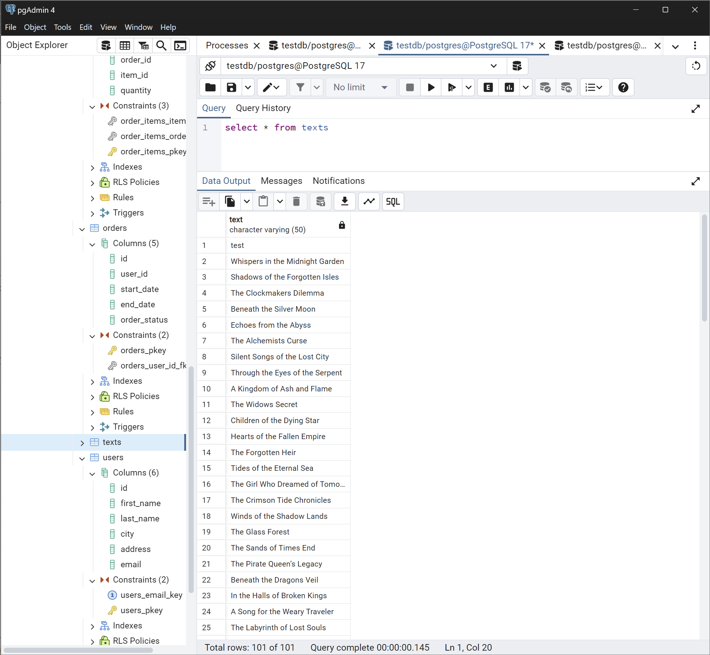
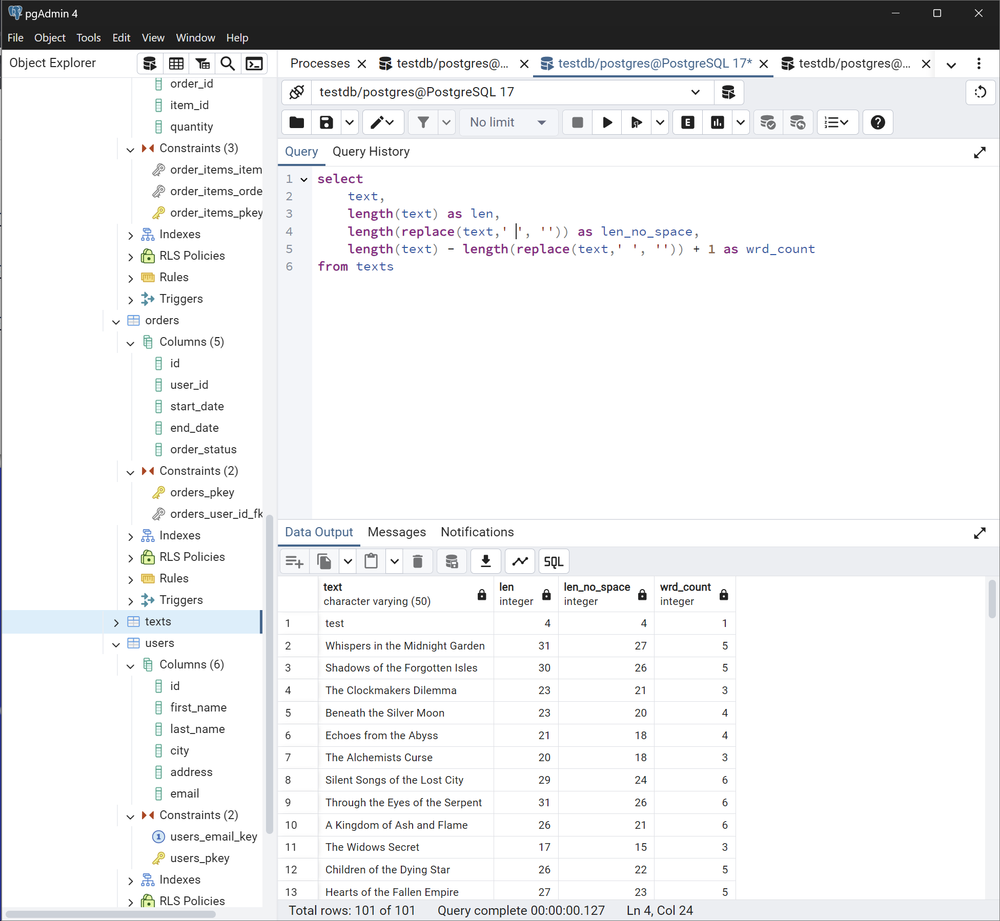
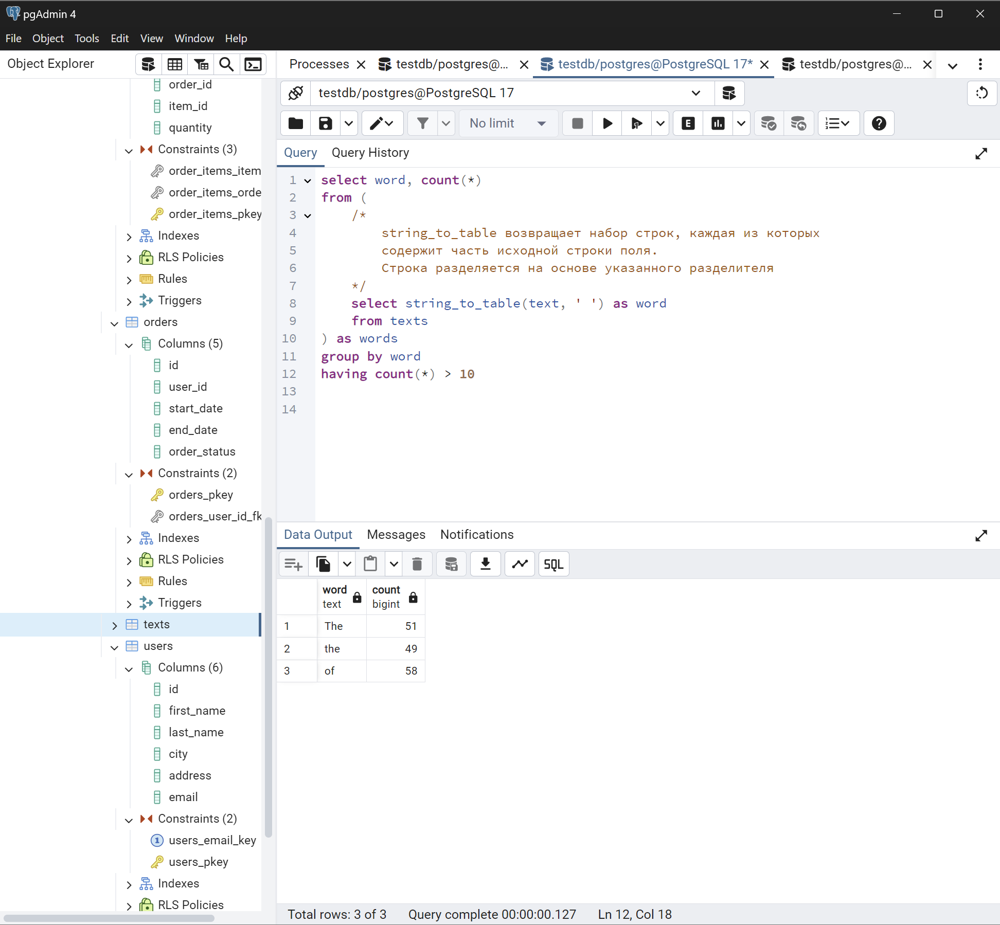
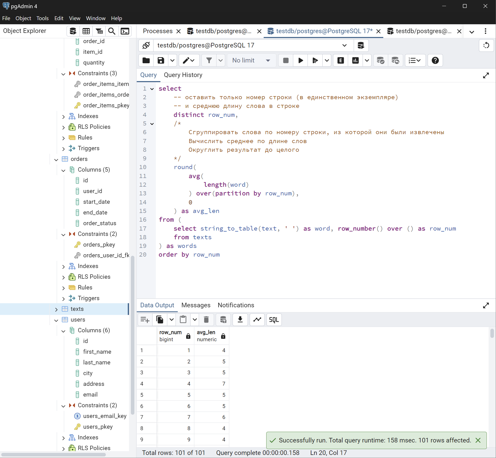
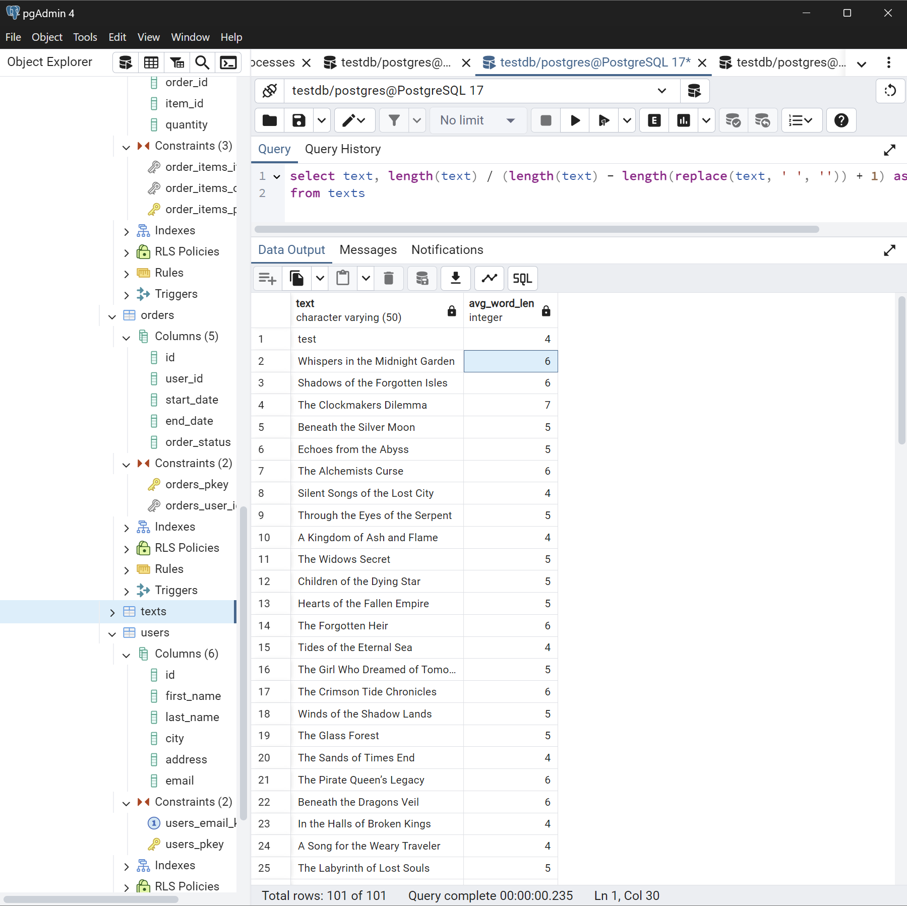
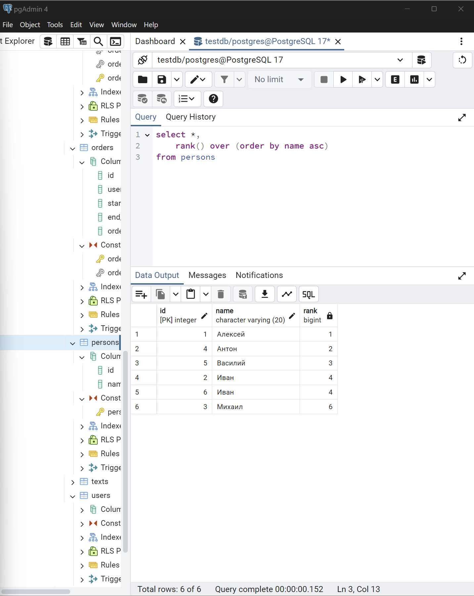
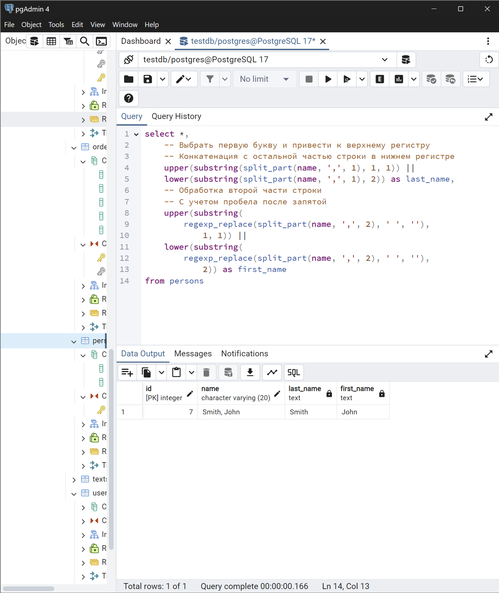
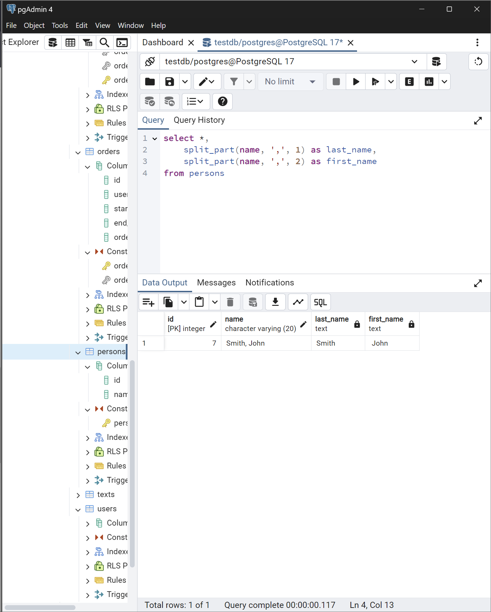

### Запросы на SQL к домашнему заданию

> Прежде всего была создана таблица texts, содержащая лишь одно поле text. В таблицу добавлены случайно сгенерированные нейросетью названия книг

> Задание 1. Напишите запрос SQL, который вычисляет количество слов в каждой строке таблицы «Тексты» и приложите скриншот запроса.

С учетом того, что слова разделены пробельным символом, для подсчета количества слов достаточно из общего количества символов в строке вычесть количество символов за вычетом пробельных и прибавить к этому количеству единицу. Т.е. если в строке 4 пробела, то в ней 5 слов.

Формула: $`length(string) - length(string.withoun.spaces) + 1`$

> Задание 2. Напишите запрос SQL, который находит все слова, которые встречаются в таблице «Тексты» более 10 раз и приложите скриншот запроса.

В решении содержимое каждого значения (поля `text`) каждой строки"разворачивается" на несколько строк по пробельному символу. После чего выполняется группировка по словам (с учетом регистра) и вычисляется их общее количество в колонке. В результате остаются только те значения, которые встречаются более десяти раз

> Задание 3. Напишите запрос SQL, который вычисляет среднюю длину слов в каждой строке таблицы «Тексты» и приложите скриншот запроса.

Первое решение - с использованием окон. Так, сначала исходные строки разбиваются на отдельные слова (каждое слово - отдельная строка в результате) в отдельном поле записывается номер исходной строки, к которой принадлежит поле.

Затем, выполняется группировка слов в окна по номеру строки, к которым они изначально принадлежали (поле `row_num`) и вычисляется их средняя длина. Результат округляется до целого числа (дробная часть отбрасывается). Т.к. группировка выполнялась в окнах, в результате остаются только строки с уникальным порядковым номером

Во втором решении выполняется вывод дополнительной колонки, в которую помещается результат деления общей длины строки на количество слов в ней (см. задание 1). На самом деле, общую длину строки следовало бы брать без учета пробельных символов))

> Задание 4. Используя оконные функции, получите ранг каждого пользователя по алфавиту в следующем списке:

| ID | NAME |
|----|----|
| 1 | Алексей |
| 2 | Иван |
| 3 | Михаил |
| 4 | Антон |
| 5 | Василий |
| 6 | Иван |

Решение основывается на вызове оконной функции `rank` с применением упорядочивания строк, к которым применяется оконная функция. Можно заметить, что ранги строк с эквивалентным содержимым поля `name` одинаковые. Вот выдержка из [документации](https://postgrespro.ru/docs/postgrespro/9.5/tutorial-window), описывающая подобное поведение при применении оконных функций:

> [!NOTE]
> Для каждой строки существует набор строк в её разделе, называемый рамкой окна. По умолчанию, с указанием ORDER BY рамка состоит из всех строк от начала раздела до текущей строки и строк, равных текущей по значению выражения ORDER BY. Без ORDER BY рамка по умолчанию состоит из всех строк раздела.

Т.е. после деления на разделы (если не указывать ключевые слова `PARTITION BY` все строки формируют один раздел), видимость строк оконной функции при обработке очередной строки ограничена предыдущими (уже обработанными) строками раздела и теми строками, значение которых по полю сортировки (в данном случае это поле `name`) одинаково

> Задание 5. Напишите запрос SQL , который разделит строку с именем и фамилией пользователя вида «Smith, John» на два отдельных столбца и приведет к верхнему регистру первую букву имени и фамилии, оставив остальное в нижнем регистре.

Для удобства, для этого задания была создана новая таблица persons с единственным значением))
Выборка (`id`, `name`) дополняются двумя полями - `last_name` и `first_name`.

Значение в поле `last_name` получается путем разбиения исходной строки по символу `,` и взятия от разбиения первой части. При этом от полученной строки берется первый символ и приводится к верхнему регистру и склеивается с оставшейся частью, приведенной к нижнему регистру.

Значение в поле `first_name` получается схожим образом, за тем исключением, что от разбиения берется вторая часть, а также из получившейся подстроки исключается пробельный символ, присутствующий после запятой в исходной строке.

В простейшем случае запрос мог бы представлять что-то подобное:

